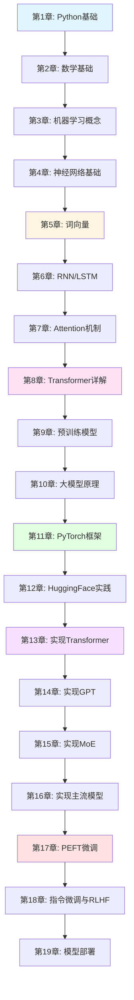

# 🚀 Build LLM from Scratch

<div align="center">

[](https://www.python.org/downloads/)
[](https://pytorch.org/)
[](LICENSE)
[](https://github.com/xzyblithe/Build-LLM-from-Scratch/stargazers)

**从零开始构建大语言模型 - 理论与实践完全指南**

[English](README_EN.md) | 简体中文

</div>

---

## 📖 项目简介

**Build LLM from Scratch** 是一套面向零基础学习者的完整大语言模型（LLM）教程。本教程从 Python 基础讲起，循序渐进地带领读者掌握从神经网络到大语言模型的所有核心知识，最终实现从零构建自己的大模型。

### 🎯 核心特色

- **✅ 零基础友好**：从 Python 基础开始，无需前置知识
- **✅ 理论实践结合**：每个概念都配有可运行的代码示例
- **✅ 从零实现**：亲手实现 Transformer、GPT、MoE、LLaMA 等架构
- **✅ 代码详尽注释**：所有代码都有清晰的中文注释
- **✅ 学习路径清晰**：19 章循序渐进，难度曲线平滑
- **✅ 工程实践导向**：包含微调、部署等生产级技术

### 🌟 你将学到

| 阶段 | 内容 |
|------|------|
| 基础阶段 | Python、数学基础、机器学习、神经网络 |
| NLP 基础 | 词向量、RNN、LSTM、Attention 机制 |
| 大模型原理 | Transformer、预训练模型、GPT 系列 |
| 框架实践 | PyTorch、Hugging Face Transformers |
| 从零实现 | Transformer、GPT、MoE、LLaMA、Qwen、DeepSeek |
| 工程实践 | PEFT 微调、指令微调、RLHF、模型部署 |

---

## 📚 整体目录大纲

### 第一阶段：基础入门（第1-4周）

| 章节 | 标题 | 核心内容 | 预计时间 |
|------|------|----------|----------|
| [第1章](chapters/chapter01-python-basics/) | Python 基础与开发环境搭建 | Python 语法、NumPy、Matplotlib | 1周 |
| [第2章](chapters/chapter02-math-foundations/) | 数学基础 | 线性代数、概率统计、微积分 | 1周 |
| [第3章](chapters/chapter03-ml-fundamentals/) | 机器学习基础概念 | 监督学习、损失函数、优化器 | 1周 |
| [第4章](chapters/chapter04-neural-networks/) | 神经网络基础 | 感知机、反向传播、激活函数 | 1周 |

### 第二阶段：深度学习与 NLP 基础（第5-7周）

| 章节 | 标题 | 核心内容 | 预计时间 |
|------|------|----------|----------|
| [第5章](chapters/chapter05-word-embeddings/) | 词向量与文本表示 | One-Hot、Word2Vec、GloVe | 1周 |
| [第6章](chapters/chapter06-rnn/) | 循环神经网络 | RNN、LSTM、GRU、Seq2Seq | 1周 |
| [第7章](chapters/chapter07-attention/) | Attention 机制 | Self-Attention、Multi-Head Attention | 1周 |

### 第三阶段：大模型原理（第8-10周）

| 章节 | 标题 | 核心内容 | 预计时间 |
|------|------|----------|----------|
| [第8章](chapters/chapter08-transformer/) | Transformer 详解 | Encoder-Decoder、位置编码 | 1周 |
| [第9章](chapters/chapter09-pretraining/) | 预训练语言模型 | BERT、GPT、Tokenization | 1周 |
| [第10章](chapters/chapter10-llm-principles/) | 大语言模型原理 | 缩放定律、涌现能力、解码策略 | 1周 |

### 第四阶段：框架实践（第11-12周）

| 章节 | 标题 | 核心内容 | 预计时间 |
|------|------|----------|----------|
| [第11章](chapters/chapter11-pytorch/) | PyTorch 深度学习框架 | Tensor、Autograd、nn.Module | 1周 |
| [第12章](chapters/chapter12-huggingface/) | Hugging Face Transformers 实战 | 模型加载、微调、Pipeline | 1周 |

### 第五阶段：从零实现大模型（第13-16周）

| 章节 | 标题 | 核心内容 | 预计时间 |
|------|------|----------|----------|
| [第13章](chapters/chapter13-transformer-from-scratch/) | 从零实现 Transformer | 完整 Transformer 实现 | 1周 |
| [第14章](chapters/chapter14-gpt-from-scratch/) | 从零实现 GPT | GPT 架构、语言模型训练 | 1周 |
| [第15章](chapters/chapter15-moe-from-scratch/) | 从零实现 MoE 架构 | 混合专家模型、路由机制 | 1周 |
| [第16章](chapters/chapter16-mainstream-llms/) | 从零实现主流大模型 | LLaMA、Qwen、DeepSeek | 1周 |

### 第六阶段：大模型工程实践（第17-19周）

| 章节 | 标题 | 核心内容 | 预计时间 |
|------|------|----------|----------|
| [第17章](chapters/chapter17-peft/) | 参数高效微调（PEFT） | LoRA、Prefix Tuning、QLoRA | 1周 |
| [第18章](chapters/chapter18-instruction-tuning-rlhf/) | 指令微调与 RLHF | 指令数据、奖励模型、DPO | 1周 |
| [第19章](chapters/chapter19-deployment/) | 模型部署与推理优化 | 量化、vLLM、分布式推理 | 1周 |

---

## 🗂️ 项目结构

```
Build-LLM-from-Scratch/
│
├── 📁 chapters/                    # 各章节文档
│   ├── chapter01-python-basics/
│   │   ├── README.md              # 章节文档
│   │   └── images/                # 配图
│   ├── chapter02-math-foundations/
│   ├── ...
│   └── chapter19-deployment/
│
├── 📁 code/                        # 代码示例
│   ├── chapter01/                  # 第1章代码
│   │   ├── 01_hello_python.py
│   │   ├── 02_numpy_basics.py
│   │   └── ...
│   ├── chapter02/
│   ├── ...
│   └── chapter19/
│
├── 📁 projects/                    # 实践项目
│   ├── mini-transformer/           # 从零实现 Transformer
│   ├── mini-gpt/                   # 从零实现 GPT
│   ├── mini-moe/                   # 从零实现 MoE
│   ├── mini-llama/                 # 从零实现 LLaMA
│   ├── mini-qwen/                  # 从零实现 Qwen
│   └── mini-deepseek/              # 从零实现 DeepSeek
│
├── 📁 notebooks/                   # Jupyter Notebook
│   ├── chapter01.ipynb
│   ├── chapter02.ipynb
│   └── ...
│
├── 📁 data/                        # 数据集
│   └── README.md                  # 数据集说明
│
├── 📁 docs/                        # 文档资源
│   ├── images/                    # 图片资源
│   └── references/                # 参考资料
│
├── 📄 README.md                    # 项目说明（本文件）
├── 📄 requirements.txt             # Python 依赖
├── 📄 ROADMAP.md                  # 学习路线图
└── 📄 LICENSE                     # 许可证
```

---

## 🛠️ 环境依赖

### 系统要求

- **操作系统**：Linux / macOS / Windows (WSL2)
- **Python 版本**：3.8 或更高
- **GPU**：推荐 NVIDIA GPU（显存 ≥ 8GB）

### Python 依赖

```txt
# 核心依赖
python>=3.8
numpy>=1.24.0
matplotlib>=3.7.0
pandas>=2.0.0

# 深度学习框架
torch>=2.0.0
torchvision>=0.15.0

# Transformers 生态
transformers>=4.35.0
tokenizers>=0.14.0
datasets>=2.14.0
accelerate>=0.24.0

# PEFT 微调
peft>=0.5.0
bitsandbytes>=0.41.0

# 可视化与工具
jupyter>=1.0.0
tensorboard>=2.14.0
tqdm>=4.66.0

# 模型部署
fastapi>=0.104.0
uvicorn>=0.24.0
```

---

## 🚀 快速开始

### 1️⃣ 克隆项目

```bash
git clone https://github.com/xzyblithe/Build-LLM-from-Scratch.git
cd Build-LLM-from-Scratch
```

### 2️⃣ 创建虚拟环境

**使用 Conda（推荐）**

```bash
# 创建虚拟环境
conda create -n llm-tutorial python=3.10

# 激活环境
conda activate llm-tutorial
```

**使用 venv**

```bash
# 创建虚拟环境
python -m venv llm-tutorial

# 激活环境
# Linux/macOS
source llm-tutorial/bin/activate

# Windows
llm-tutorial\Scripts\activate
```

### 3️⃣ 安装依赖

```bash
# 安装 PyTorch（根据你的 CUDA 版本选择）
# CUDA 11.8
pip install torch torchvision --index-url https://download.pytorch.org/whl/cu118

# CUDA 12.1
pip install torch torchvision --index-url https://download.pytorch.org/whl/cu121

# CPU only
pip install torch torchvision

# 安装其他依赖
pip install -r requirements.txt
```

### 4️⃣ 运行示例代码

```bash
# 进入代码目录
cd code/chapter01

# 运行第一个示例
python 01_hello_python.py
```

### 5️⃣ 启动 Jupyter Notebook

```bash
# 启动 Jupyter
jupyter notebook

# 打开 notebooks/chapter01.ipynb 开始学习
```

---

## 📊 学习路径图



### 学习时间规划

| 学习方式 | 建议时间 | 每周投入 |
|----------|----------|----------|
| **全职学习** | 12-16 周 | 40+ 小时 |
| **业余学习** | 20-24 周 | 15-20 小时 |
| **周末学习** | 30-36 周 | 10-15 小时 |

---

## 💡 学习建议

### ✅ 推荐做法

1. **按顺序学习**：章节之间有依赖关系，建议按顺序学习
2. **动手实践**：不要只看代码，要自己敲一遍
3. **调试实验**：尝试修改参数，观察效果变化
4. **做好笔记**：记录学习心得和遇到的问题
5. **参与讨论**：在 Issues 中提问和分享

### ❌ 避免误区

1. ❌ 跳过基础章节直接看高级内容
2. ❌ 只看不练，不动手写代码
3. ❌ 死磕复杂公式，忽略直观理解
4. ❌ 追求完美，每章都要完全掌握才继续

---

## 🎯 实践项目

### 项目 1：Mini Transformer

从零实现一个完整的 Transformer 模型，用于机器翻译任务。

**技术栈**：
- Multi-Head Self-Attention
- Position Encoding
- Encoder-Decoder 架构
- Beam Search 解码

📁 项目地址：[projects/mini-transformer/](projects/mini-transformer/)

---

### 项目 2：Mini GPT

从零实现 GPT 架构，训练一个中文文本生成模型。

**技术栈**：
- Decoder-only Transformer
- 因果注意力掩码
- 自回归文本生成
- 多种采样策略

📁 项目地址：[projects/mini-gpt/](projects/mini-gpt/)

---

### 项目 3：Mini MoE

从零实现混合专家模型（Mixture of Experts）。

**技术栈**：
- Expert 层
- Top-k 路由机制
- 负载均衡损失
- 稀疏激活

📁 项目地址：[projects/mini-moe/](projects/mini-moe/)

---

### 项目 4：Mini LLaMA

实现 LLaMA 架构的核心组件。

**技术栈**：
- RoPE（旋转位置编码）
- RMSNorm
- SwiGLU 激活函数
- GQA（分组查询注意力）

📁 项目地址：[projects/mini-llama/](projects/mini-llama/)

---

## 📖 配套资源

### 📚 推荐阅读

- [《从零构建大模型：算法、训练与微调》](https://github.com/xzyblithe/Build-LLM-from-Scratch) - 梁楠，清华大学出版社
- [Attention Is All You Need](https://arxiv.org/abs/1706.03762) - Transformer 原始论文
- [BERT: Pre-training of Deep Bidirectional Transformers](https://arxiv.org/abs/1810.04805) - BERT 论文
- [Language Models are Few-Shot Learners](https://arxiv.org/abs/2005.14165) - GPT-3 论文

### 🔗 实用链接

- [Hugging Face 模型库](https://huggingface.co/models)
- [PyTorch 官方文档](https://pytorch.org/docs/)
- [Transformers 文档](https://huggingface.co/docs/transformers/)

### 🎥 视频教程（规划中）

- B站：配套视频讲解
- YouTube：英文版教程

---

## 🤝 贡献指南

欢迎为本项目做出贡献！

### 如何贡献

1. **Fork 本仓库**
2. **创建特性分支** (`git checkout -b feature/AmazingFeature`)
3. **提交更改** (`git commit -m 'Add some AmazingFeature'`)
4. **推送到分支** (`git push origin feature/AmazingFeature`)
5. **创建 Pull Request**

### 贡献类型

- 🐛 修复 Bug
- 📝 改进文档
- 💡 添加新示例
- 🌍 翻译文档
- 🎨 优化代码

---

## 📜 许可证

本项目采用 MIT 许可证 - 详见 [LICENSE](LICENSE) 文件

---

## 🙏 致谢

感谢以下资源和项目的启发：

- [The Illustrated Transformer](http://jalammar.github.io/illustrated-transformer/)
- [Andrej Karpathy's minGPT](https://github.com/karpathy/minGPT)
- [Hugging Face Transformers](https://github.com/huggingface/transformers)
- [PyTorch Tutorial](https://github.com/pytorch/tutorials)

---

## 📮 联系方式

- **作者**：xzyblithe
- **GitHub**：[@xzyblithe](https://github.com/xzyblithe)
- **项目主页**：[Build-LLM-from-Scratch](https://github.com/xzyblithe/Build-LLM-from-Scratch)

---

## ⭐ Star History

如果这个项目对你有帮助，请给一个 ⭐ Star 支持一下！

<div align="center">

**Happy Learning! 🎉**

</div>
